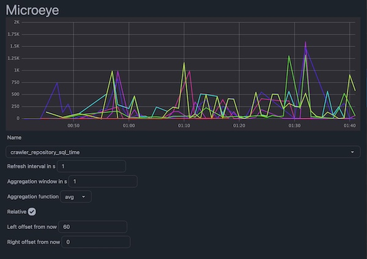

# Microeye

> A simple custom metrics storage and visualization tool.



```bash
docker run -p 3000:3000 -v microeye_data:/var/lib/postgresql/data microeye
```

Open the browser to see ui.

To push metrics run

```bash
curl -X POST -H "Content-Type: application/json" -d '{"name":"cpu","labels":{"a":"b"},"value":1}' http://localhost:3000/push
```

or use example pushers from `./pusher` directory.

To push metrics from js use or make your own pusher

```js
import axios from "axios";

class Pusher {
  constructor(host) {
    this.host = host;
  }

  async pushMetric(name, value, labels) {
    await axios.post(`${this.host}/push`, {
      name,
      value,
      labels,
    });
  }
}

export default Pusher;
```
